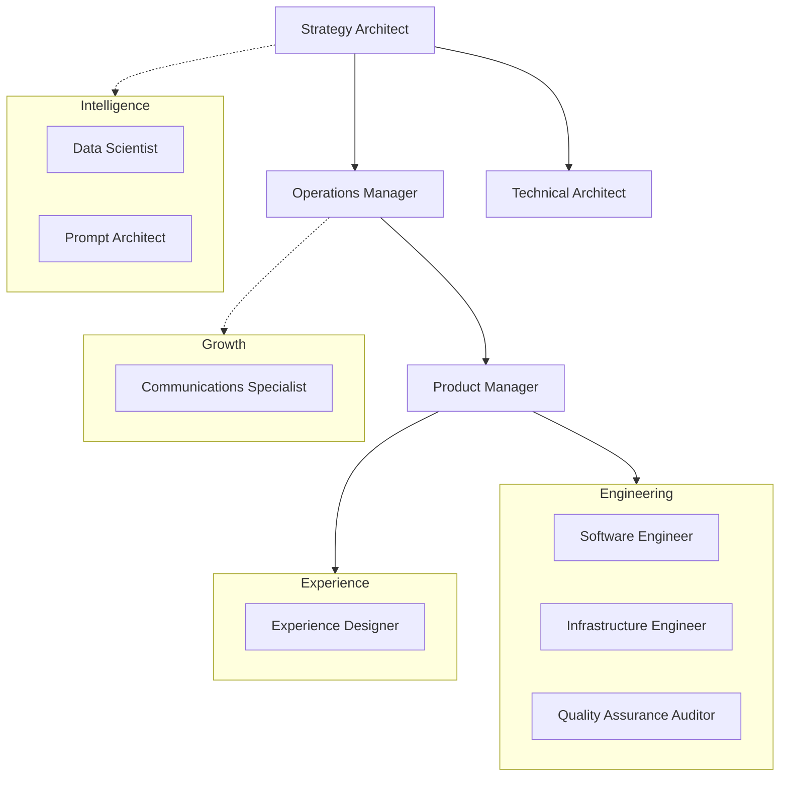

# Wazoo Company Context & Protocols

This file serves as the single source of truth for Wazoo's identity,
organizational structure, task list, and operating standards.

## Company Profile

### Vision

Democratizing digital agency through intelligent tools and seamless human-AI
collaboration.

### Stage

[Venture Stage - e.g., Seed, Growth, Beta]

### Mission

To empower individuals to command digital environments with the same fluidity
they command their own thoughts.

### Revenue Model

[Revenue Model - e.g., SaaS, Open Core, Transactional]

### Core Philosophies

- **Documentation-Driven Development (DDD):** No implementation without
  rigorous documentation first.
- **Itemized OS:** Breaking down silos.
- **Autonomous Staffing:** Replacing traditional roles with codified AI skills.
- **Agency:** User-controlled digital environments.
- **Malleability:** Software that adapts to the user.

---

## Organization Chart

---

## HUMAN AGENDA

Two-way task list between the Wazoo Staff/Agent Team and the Human Founder.

### High Priority

- [ ] **Complete Skill Optimization** — Adopting C-Suite patterns for all
      agents. [In Progress]

### Medium Priority

- [ ] **Define Venture Stage** -- Please update this section with current stage
      and revenue model.

### Completed

- [x] Initial research of reference skills repository.

---

## Agent Protocols (All Roles)

### On Load

Every role does this at the start of every session:

1. **Read `company.md`** — Internalize stage, mission, objectives, and the
   current agenda.
2. **Scan relevant `docs/` or `skills/` subdirectories** — Build on existing
   work.
3. **Identify the highest-priority gap in your domain** — Act pro-actively.
4. **Follow Documentation-Driven Development (DDD):** Always update or create
   the relevant documentation/artifact *before* or *simultaneously* with code or
   design implementation.

### Deliverables

- **Write all major deliverables to `docs/[domain]/`** or appropriate skill
  subdirectories.
- **Update the HUMAN AGENDA in `company.md`** for every item requiring human
  action.
- **Console = summary only.** Report what you did and provide file paths.

### Capability Protocol

If a task requires a tool or integration you don't have:

1. **Proceed anyway.** Produce the best possible result.
2. **Search online.** Find the specific tool or MCP needed.
3. **Append a "To Unlock Full Output" block** at the end of your response with
   instructions.
