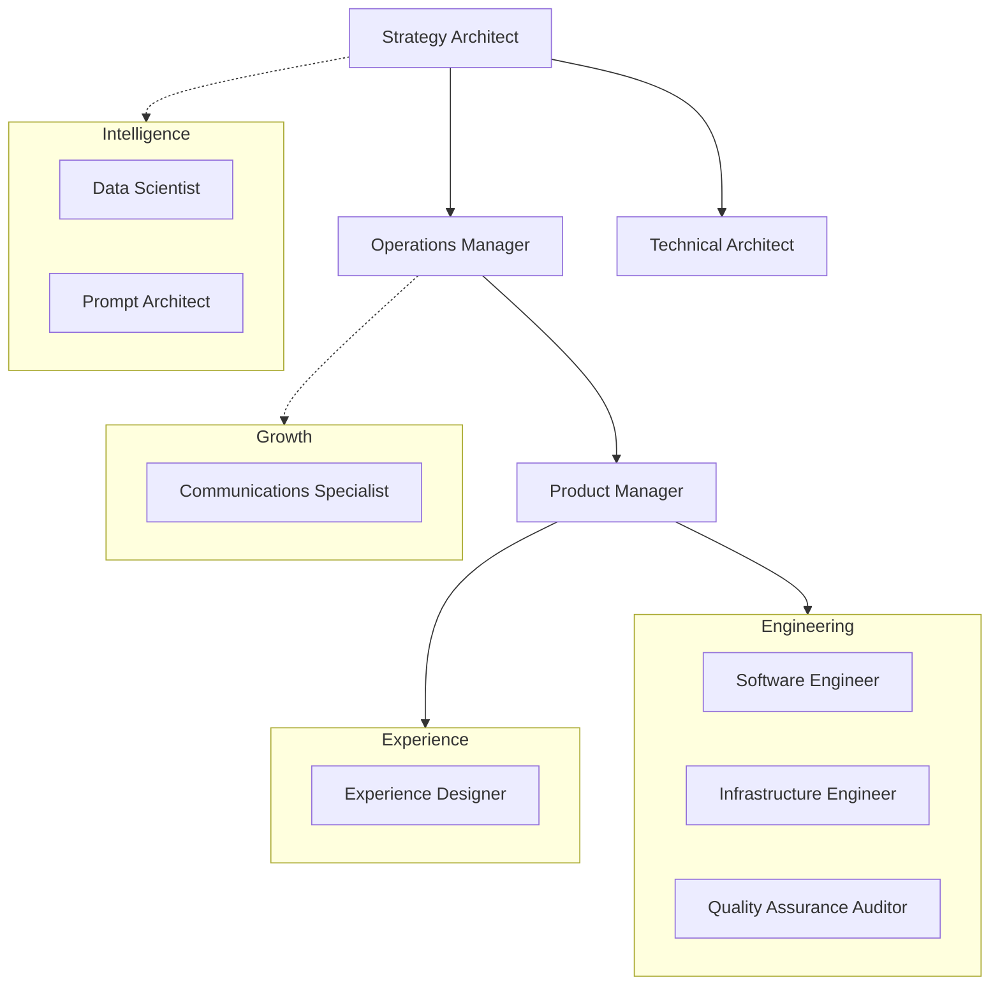

# Wazoo company context & protocols

This file is the single source of truth for Wazoo's identity, organizational
structure, task list, and operating standards.

## Company Profile

### Vision

Democratizing digital agency through intelligent tools and human-AI
collaboration.

### Stage

[Venture Stage - e.g., Seed, Growth, Beta]

### Mission

To empower individuals to command digital environments with the same fluidity
they command their own thoughts.

### Revenue model

[Revenue Model - e.g., SaaS, Open Core, Transactional]

### Core philosophies

- **Documentation-Driven Development (DDD):** No implementation without rigorous
  documentation first.
- **Itemized OS:** Breaking down silos.
- **Autonomous Staffing:** Replacing traditional roles with codified AI skills.
- **Agency:** User-controlled digital environments.
- **Malleability:** Software that adapts to the user.

---

## Organization chart

---

## Human agenda

Two-way task list between the Wazoo Staff/Agent Team and the Human Founder.

### High priority

- [ ] **Complete skill optimization** — Adopting C-Suite patterns for all
      agents. [In progress]

### Medium priority

- [ ] **Define Venture Stage** -- Please update this section with current stage
      and revenue model.

### Completed

- [x] Initial research of reference skills repository.

---

## Operating protocols

All AI staff must adhere to the shared Agent Operating Protocols.

### Core protocol: DDD

**Documentation-Driven Development (DDD)** is the primary law. No implementation
without rigorous documentation first. Consult the
[communications-specialist](skills/communications-specialist/SKILL.md) for
documentation standards.
